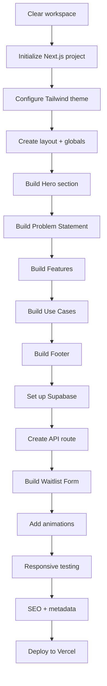

# LU Teams Landing Page - Implementation Plan

## Overview

Building a modern, Vercel-compatible landing page for LU Teams using Next.js 14, TypeScript, Tailwind CSS, and Supabase for waitlist management.

## Tech Stack

| Technology | Purpose |
|------------|---------|
| Next.js 14 (App Router) | React framework with server components |
| TypeScript | Type safety |
| Tailwind CSS | Styling with custom theme |
| Supabase | PostgreSQL database for waitlist |
| Vercel | Deployment platform |

## Project Structure

```
lu-teams-landing/
├── app/
│   ├── layout.tsx          # Root layout with fonts, metadata
│   ├── page.tsx            # Main landing page
│   ├── globals.css         # Global styles, Tailwind imports
│   ├── api/
│   │   └── waitlist/
│   │       └── route.ts    # POST endpoint for waitlist submissions
│   └── favicon.ico
├── components/
│   ├── Hero.tsx            # Hero section with animated logo
│   ├── ProblemStatement.tsx
│   ├── Features.tsx
│   ├── UseCases.tsx
│   ├── WaitlistForm.tsx    # Form with validation
│   └── Footer.tsx
├── lib/
│   └── supabase.ts         # Supabase client configuration
├── public/
│   ├── logo.svg            # LU Teams logo
│   ├── favicon-16x16.png
│   ├── favicon-32x32.png
│   ├── apple-touch-icon.png
│   └── android-chrome-*.png
├── tailwind.config.ts      # Custom theme colors
├── next.config.js
├── package.json
├── tsconfig.json
└── .env.local              # Supabase credentials (gitignored)
```

## Design System

### Colors (Tailwind Config)

```typescript
colors: {
  navy: '#0a192f',      // Background
  cyan: '#64ffda',      // Primary accent
  purple: 'hsl(260, 100%, 65%)', // Secondary accent
  slate: {
    300: '#ccd6f6',     // Primary text
    400: '#8892b0',     // Secondary text
  }
}
```

### Typography

- Headings: Inter (Google Fonts) - Bold
- Body: Inter - Regular
- Monospace accents: JetBrains Mono

### Component Styling Patterns

- Neon glow effect: `shadow-[0_0_30px_rgba(100,255,218,0.5)]`
- Glass morphism cards: `bg-white/5 backdrop-blur-sm border border-cyan/20`
- Hover transitions: `transition-all duration-300`

## Component Specifications

### 1. Hero Section

- Animated LU logo with pulsing neon cyan glow (CSS keyframes)
- Large headline with gradient text effect
- Subheadline with fade-in animation
- CTA button scrolls to waitlist form
- Optional: Animated background particles/grid

### 2. Problem Statement

- Single impactful statement
- Subtle entrance animation on scroll
- Centered layout with max-width constraint

### 3. Features Section

Three feature cards with icons:

| Feature | Icon Suggestion |
|---------|-----------------|
| Personality Analysis | Brain/Chart icon |
| Conflict Prediction | Shield/Warning icon |
| Smart Recommendations | Lightbulb/Target icon |

Each card:
- Icon with cyan glow
- Title
- Brief description
- Hover effect with border glow

### 4. Use Cases Section

Three industry cards:

| Industry | Visual |
|----------|--------|
| Aerospace & Defense | Rocket/Plane icon |
| Tech & SaaS | Code/Cloud icon |
| Advanced Manufacturing | Factory/Gear icon |

Cards with subtle background patterns, hover effects

### 5. Waitlist Form

```typescript
interface WaitlistSubmission {
  email: string;        // required, validated
  name?: string;        // optional
  company?: string;     // optional
  role?: string;        // optional
  industry?: string;    // optional, dropdown
}
```

Form states:
- Default: All fields visible
- Loading: Spinner, disabled inputs
- Success: Thank you message with checkmark
- Error: Error message with retry option

Validation:
- Client-side: Zod schema
- Server-side: Same Zod schema in API route

### 6. Footer

- Copyright: © 2025 LU Teams by Leadership Unfiltered
- Simple, minimal design
- Optional: Social links, privacy policy link

## Database Schema (Supabase)

```sql
CREATE TABLE waitlist (
  id UUID DEFAULT gen_random_uuid() PRIMARY KEY,
  email TEXT NOT NULL UNIQUE,
  name TEXT,
  company TEXT,
  role TEXT,
  industry TEXT,
  created_at TIMESTAMP WITH TIME ZONE DEFAULT NOW(),
  updated_at TIMESTAMP WITH TIME ZONE DEFAULT NOW()
);

-- Index for email lookups
CREATE INDEX idx_waitlist_email ON waitlist(email);

-- Row Level Security
ALTER TABLE waitlist ENABLE ROW LEVEL SECURITY;

-- Policy: Allow inserts from API
CREATE POLICY "Allow public inserts" ON waitlist
  FOR INSERT
  WITH CHECK (true);
```

## API Route: /api/waitlist

```typescript
// app/api/waitlist/route.ts
export async function POST(request: Request) {
  // 1. Parse request body
  // 2. Validate with Zod
  // 3. Check for duplicate email
  // 4. Insert into Supabase
  // 5. Return success/error response
}
```

Response format:
```typescript
// Success
{ success: true, message: "You're on the list!" }

// Error
{ success: false, error: "Email already registered" | "Invalid email" | "Server error" }
```

## Environment Variables

```env
# .env.local
NEXT_PUBLIC_SUPABASE_URL=https://your-project.supabase.co
NEXT_PUBLIC_SUPABASE_ANON_KEY=your-anon-key

# For server-side operations (optional, for admin operations)
SUPABASE_SERVICE_ROLE_KEY=your-service-role-key
```

## Vercel Deployment

### vercel.json (optional, defaults work well)

```json
{
  "framework": "nextjs",
  "regions": ["iad1"]
}
```

### Environment Variables in Vercel Dashboard

Set the same environment variables from `.env.local` in the Vercel project settings.

## SEO & Metadata

```typescript
// app/layout.tsx
export const metadata: Metadata = {
  title: 'LU Teams - The Technical Leader\'s Sixth Sense for Team Chemistry',
  description: 'Stop guessing who works well together. LU Teams analyzes personality dynamics to predict team synergy before you even start a project.',
  keywords: ['team chemistry', 'personality analysis', 'team building', 'leadership tools'],
  openGraph: {
    title: 'LU Teams',
    description: 'Predict team synergy before you start',
    images: ['/og-image.png'],
  },
  twitter: {
    card: 'summary_large_image',
  },
};
```

## Animation Strategy

Using CSS animations for performance:

1. **Logo pulse**: Keyframe animation with glow intensity changes
2. **Scroll animations**: Intersection Observer + CSS classes
3. **Hover effects**: CSS transitions (transform, box-shadow)
4. **Form feedback**: Tailwind's `animate-spin`, `animate-pulse`

## Responsive Breakpoints

- Mobile: < 640px (single column)
- Tablet: 640px - 1024px (2 columns for features/use cases)
- Desktop: > 1024px (3 columns, larger typography)

## Implementation Order



## Dependencies

```json
{
  "dependencies": {
    "next": "14.x",
    "react": "18.x",
    "react-dom": "18.x",
    "@supabase/supabase-js": "^2.x",
    "zod": "^3.x"
  },
  "devDependencies": {
    "typescript": "^5.x",
    "@types/node": "^20.x",
    "@types/react": "^18.x",
    "tailwindcss": "^3.x",
    "autoprefixer": "^10.x",
    "postcss": "^8.x"
  }
}
```

## Notes

- The landing page will be a single-page design with smooth scrolling between sections
- All sections will be server components except WaitlistForm (client component for interactivity)
- Form submission will use the native `fetch` API
- No additional animation libraries needed - CSS animations are sufficient